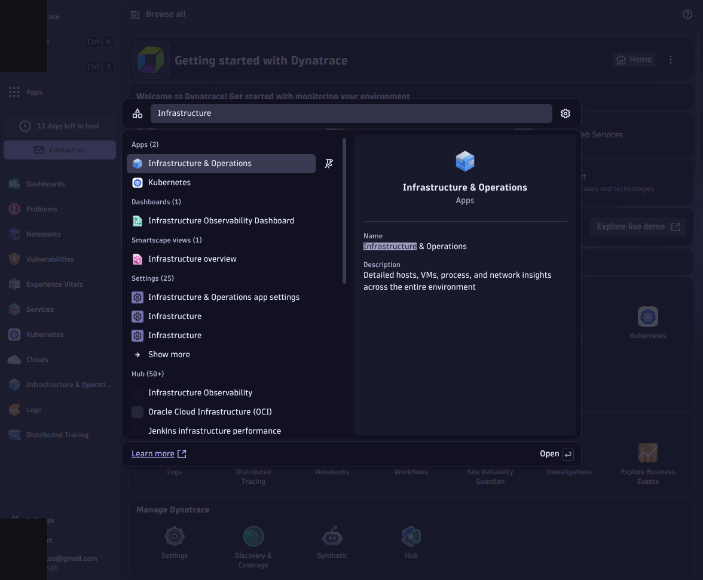
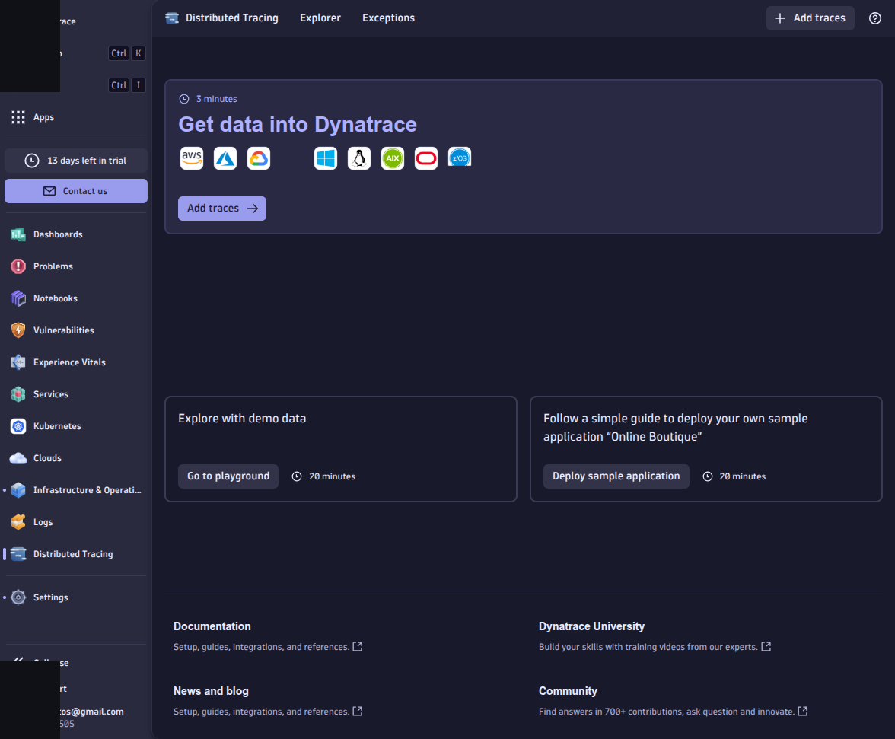
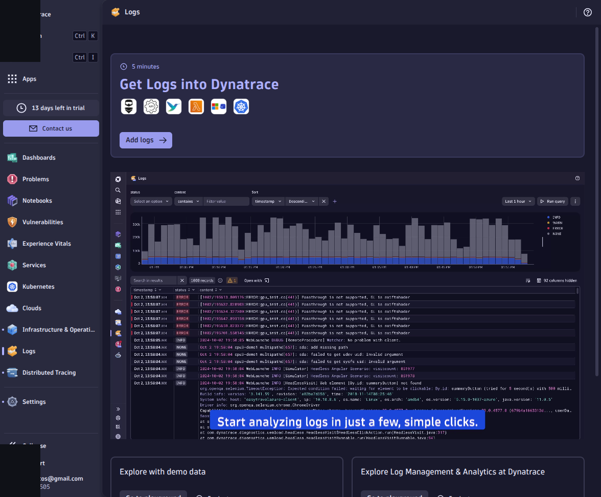
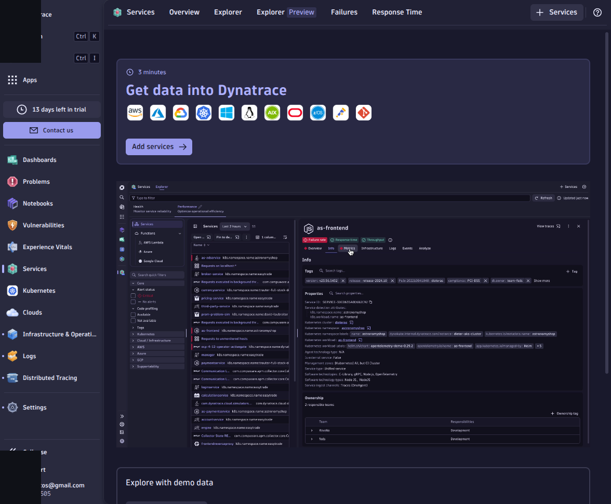
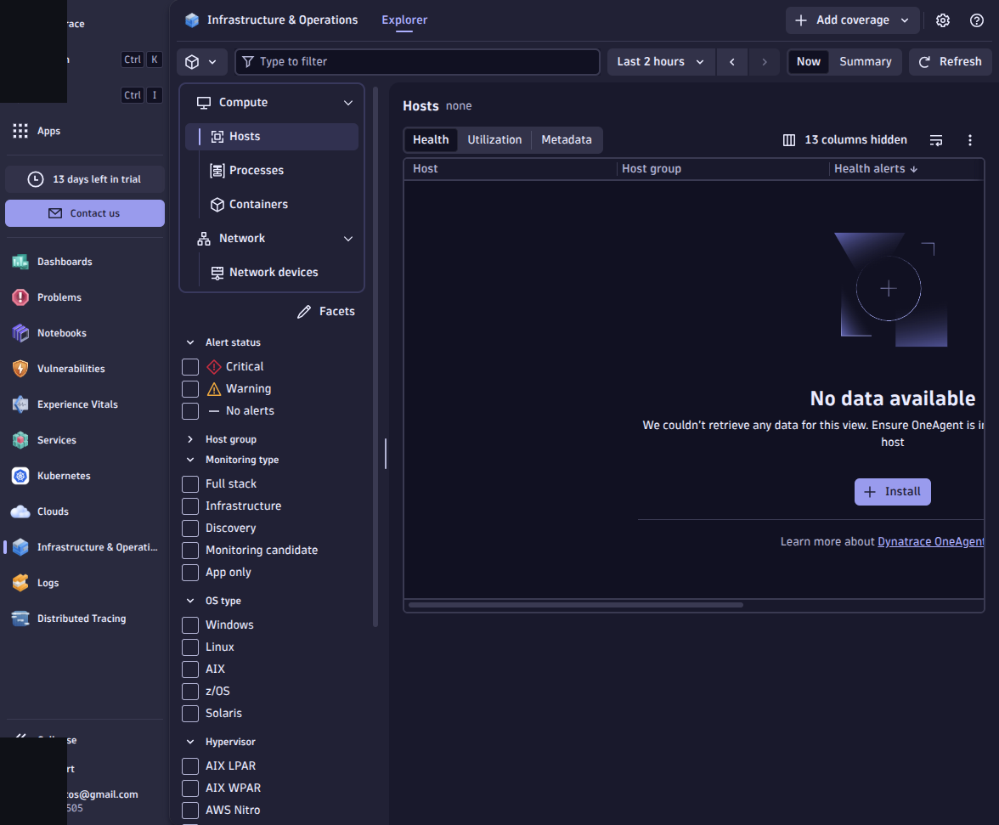
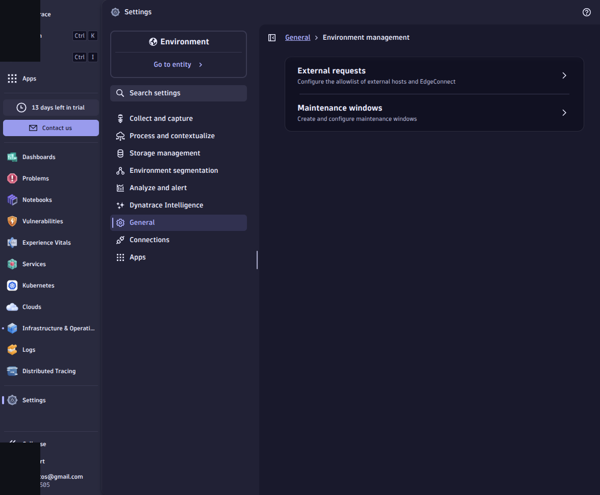

# M01-02 — Primera navegación en Dynatrace

[← Página anterior](M01-01-bootstrap-entorno.md) · [Siguiente página →](../M02-arquitectura-smartscape/README.md)

> Práctica del módulo. La teoría y la demo están en el [README del módulo](README.md).

### Objetivo

Orientarte en la UI Dynatrace y localizar las apps y vistas que usarás en el curso.

### Prerrequisitos

- M01-01 completado (tenant accesible).

### En qué consiste

Recorrido por Launcher, búsqueda global y apps de infraestructura, trazas y logs (sin datos del lab aún si OneAgent no está instalado).

### 1 — Hub y búsqueda

**Acción:** Inicia sesión en tu tenant. Abre **Launcher** (página de inicio) y la **búsqueda global** (<kbd>Ctrl</kbd> + <kbd>K</kbd> o icono de lupa).
**Por qué:** Launcher concentra apps y onboarding; la búsqueda acelera navegación en módulos siguientes.
**Resultado esperado:** Localizas apps como **Infrastructure & Operations**, **Distributed Tracing** y **Logs**.

Vistas que reutilizarás en M04 y M06 (pueden mostrar onboarding o datos de demo del tenant hasta que instales OneAgent):

### 2 — Vista de technologies

**Acción:** Abre la app **Infrastructure & Operations** → **Explorer** → **Hosts** (nombre puede variar según versión de UI).
**Por qué:** En M03 aparecerán aquí los hosts del Codespace.
**Resultado esperado:** Lista vacía o mensaje «No data available»; aún normal sin OneAgent.

### 3 — Settings de environment

**Acción:** Abre **Settings** (búsqueda global o dock) → **General** → **Environment management**. También puedes ver el ID del environment en el perfil de usuario (esquina inferior izquierda).
**Por qué:** Naming rules, maintenance windows y zones se configuran aquí (M06).
**Resultado esperado:** Identificas el nombre/ID del environment de tu trial.

## Comprueba tu entendimiento

**Apps clave**
Enumera tres apps o vistas que usarás antes del final del curso (infra, trazas, logs).
→ Al menos una de infraestructura, una de trazas/servicios y una de logs/dashboards.

## Reto

### 1 — Atajo personal

Guarda en favoritos del navegador la URL directa a Distributed traces o Services.

Ver orientación

Copia la URL tras abrir la app desde el menú; servirá en M04.

## Errores frecuentes

| Síntoma | Causa probable | Cómo arreglarlo |
|---------|----------------|-----------------|
| UI distinta a capturas del curso | Dynatrace actualiza apps con frecuencia | Usa búsqueda global por nombre de capacidad |
| No ves datos del lab | OneAgent pendiente (M03) | Esperado en M01-02 |
