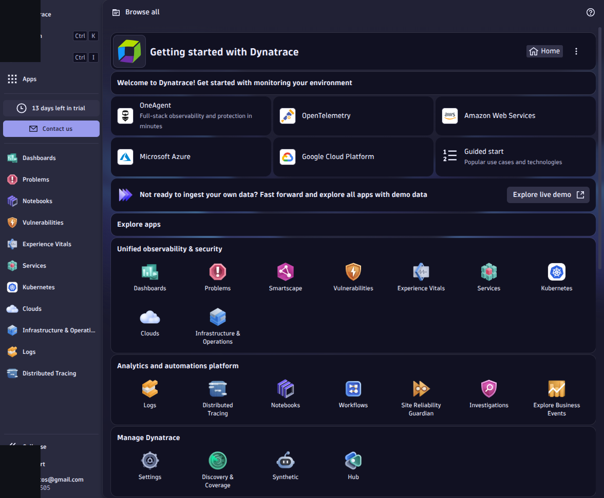

# M01 — Entorno del curso y plataforma Dynatrace

[← Página anterior](../../README.md) · [Siguiente página →](M01-01-bootstrap-entorno.md)

> [!NOTE]
> **Cómo funciona este módulo.** Primero la **teoría**, luego la **demostración guiada** del
> formador, y después **practicas tú** en el/los laboratorio(s).

## Qué aprenderás

- Preparar tu fork y Codespace con la infraestructura del curso.
- Configurar un tenant **Dynatrace SaaS trial** y los tokens del laboratorio.
- Levantar la stack demo (web, API, Postgres, Redis, carga).
- Navegar la interfaz Dynatrace y localizar el entorno de prácticas.

## Teoría

Dynatrace es una plataforma de observabilidad **full-stack** alojada en **SaaS** (en este curso). Los datos los recogen **OneAgent** y componentes de ingest desde tu entorno de lab; la UI y la inteligencia (Davis) viven en el tenant cloud.

| Componente | Rol en el lab |
|------------|----------------|
| **Tenant SaaS** | UI, problemas, dashboards, Grail |
| **OneAgent** | Instrumentación en hosts/contenedores (M03+) |
| **Operator** | Despliegue en Kubernetes (M05) |
| **Codespace** | Donde corren las aplicaciones demo |

> [!IMPORTANT]
> No instalamos **Dynatrace Managed** en el Codespace. El servidor de plataforma es el trial SaaS.

## Demostración guiada

> Recorrido del formador (tono descriptivo).

1. En GitHub, el repositorio del curso se abre en Codespaces desde el fork del alumno.
2. En el tenant Dynatrace, la app **Kubernetes** o el asistente de **Add monitoring** muestra cómo generar tokens Operator e ingest.
3. Tras `./scripts/lab-up.sh`, los servicios `demo-web` y `demo-api` quedan accesibles en los puertos 8080 y 8081 del Codespace.
4. En la UI Dynatrace, el **Launcher** conduce a apps de infraestructura, trazas y logs (aún vacías o en onboarding hasta M03).

## Ahora practica tú

| Lab | Título | Qué harás |
|-----|--------|-----------|
| M01-01 | [Bootstrap del entorno](M01-01-bootstrap-entorno.md) | Fork, Codespace, `.env`, stack Docker |
| M01-02 | [Primera navegación en Dynatrace](M01-02-navegacion-ui.md) | Hub, apps, búsqueda global |

→ Empieza por **[M01-01 — Bootstrap del entorno](M01-01-bootstrap-entorno.md)**.
