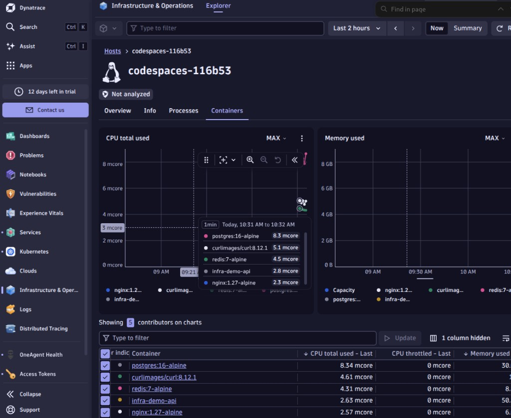
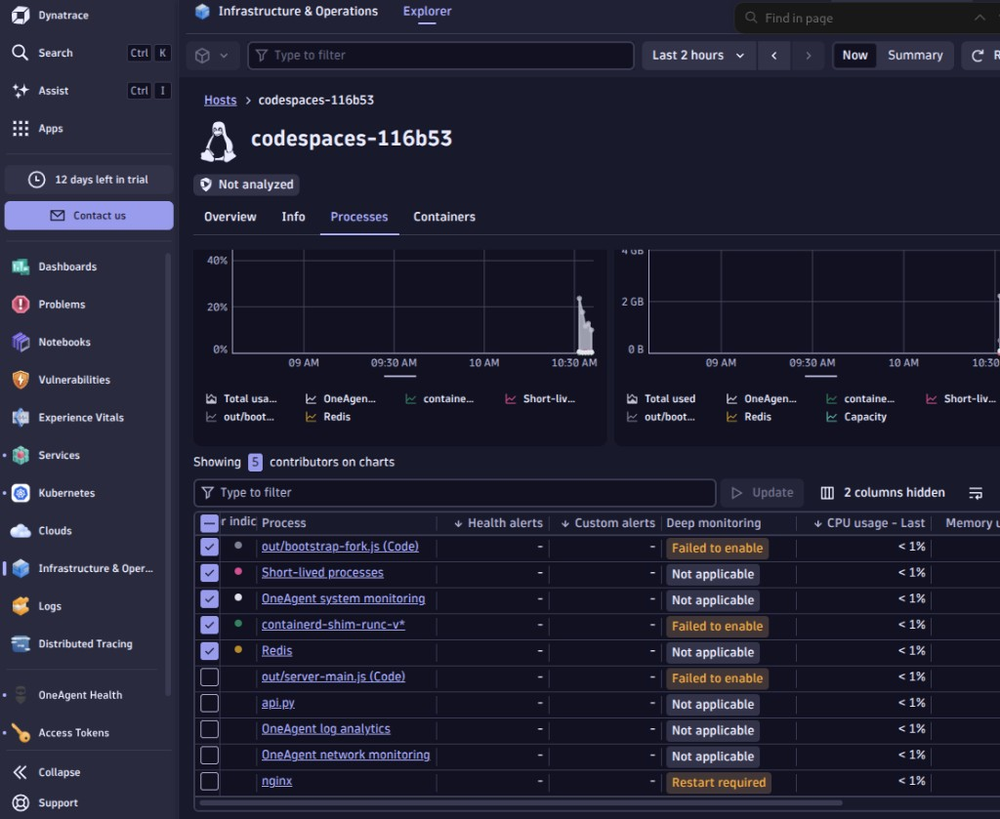

# M03-01 — OneAgent en Compose

[← Página anterior](README.md) · [Siguiente página →](M03-02-procesos-bases-datos.md)

> Práctica del módulo. La teoría y la demo están en el [README del módulo](README.md).

### Objetivo

Desplegar OneAgent, validar **infraestructura** en Dynatrace y comprobar los **límites** del agente en contenedor en Codespace (preparación para OTel en M04).

### Prerrequisitos

- M01-01 completado (`./scripts/lab-up.sh` OK).
- `DYNATRACE_ENVIRONMENT_URL` con dominio **`.live.dynatrace.com`** en `infra/.env`.
- **PaaS token** en `ONEAGENT_PAAS_TOKEN`.

---

### Paso 1 — Desplegar OneAgent

**Acción:**

```bash
./scripts/oneagent-up.sh
./scripts/oneagent-status.sh
```

**Qué observar en terminal**

| Señal | Interpretación |
|-------|----------------|
| `OneAgent arrancado` + estado **Up** | Agente descargado y en ejecución |
| `Restarting` / `Initialization failed` | Ver [TROUBLESHOOTING](../TROUBLESHOOTING.md#oneagent-no-arranca-o-reinicia-m03) |
| Logs `Healthy(0)` | Procesos internos del agente OK |

**Resultado esperado:** contenedor `dynatrace-oneagent` estable (no reinicia cada minuto).

---

### Paso 2 — Validar conexión del agente

**Acción:** <kbd>Ctrl</kbd>+<kbd>K</kbd> → **OneAgent health** (o **Deployments → OneAgents**).

**Qué observar**

| Elemento | Qué significa |
|----------|----------------|
| Gráfica/tarta con **1 agente** conectado | Tu Codespace reporta al tenant |
| Host `codespaces-…` | Entidad del lab (no confundir con demo del trial) |

**Resultado esperado:** al menos **un** OneAgent conectado tras 2–5 min.

---

### Paso 3 — Infraestructura: host y contenedores

**Acción:** <kbd>Ctrl</kbd>+<kbd>K</kbd> → **Infrastructure** → abre el host `codespaces-…`.

**Qué observar por pestaña**

| Pestaña | Qué mirar | Qué interpretar |
|---------|-----------|-----------------|
| **Overview** | Tecnologías (Python, Postgres, Docker…) | Dynatrace **descubre** stack sin configurar nada |
| **Containers** | `infra-demo-api`, `postgres`, `redis`, `nginx`… | Stack Compose visible |
| **Processes** | `api.py`, `nginx`, Redis… | Procesos dentro del host |
| **Info** | Versión OneAgent, Full stack | Agente activo en este host |

**Resultado esperado:** contenedores del lab con CPU/memoria en los últimos 5 min.



---

### Paso 4 — Deep monitoring: el límite del lab (importante)

**Acción:** En el host → pestaña **Processes** → localiza `api.py` (demo-api).

**Qué observar**

| Columna Deep monitoring | Significado en Codespace |
|---------------------------|--------------------------|
| **Not applicable** | Monitorización solo de infra (Redis, procesos sistema) |
| **Failed to enable** | OneAgent en contenedor **no inyecta** en ese proceso |
| **Restart required** (nginx) | Proceso arrancó antes que el agente; reinicio puede ayudar |

**Interpretación (para clase):**

- OneAgent **sí** ve host, contenedores y procesos.
- **No** garantiza trazas de aplicación Flask en Codespace (Docker anidado).
- Por eso **Services** puede seguir vacío y **Distributed Tracing** solo muestra **nginx** (`localhost:80`) — eso **no es error del alumno**.

**Comprueba:** <kbd>Ctrl</kbd>+<kbd>K</kbd> → **Distributed Tracing** → filtro **Process group** = `nginx` → ves trazas del loadgen a demo-web.



**Resultado esperado:** entiendes la diferencia entre **infra observada** y **app no instrumentada aún**.

---

### Paso 5 — Cierre M03-01

| Pregunta | Respuesta correcta |
|----------|-------------------|
| ¿Ves tu host en Infrastructure? | Sí |
| ¿Ves contenedores del lab? | Sí |
| ¿`demo-api` tiene deep monitoring OK? | A menudo **no** en Codespace |
| ¿Qué módulo añade trazas de Flask? | **M04** (OpenTelemetry en demo-api) |

→ Continúa con **[M03-02 — Procesos y bases de datos](M03-02-procesos-bases-datos.md)** y después **M04**.

---

## Errores frecuentes

| Síntoma | Cómo arreglarlo |
|---------|-----------------|
| `ERROR: ONEAGENT_PAAS_TOKEN vacío` | Genera PaaS token y rellena `.env` |
| Contenedor reinicia | [TROUBLESHOOTING — OneAgent](../TROUBLESHOOTING.md#oneagent-no-arranca-o-reinicia-m03) |
| Sin contenedores en UI | `lab-up.sh` + espera 5 min |
| Services vacío tras M03 | **Normal** hasta M04 |

## Referencia

- `scripts/oneagent-up.sh`
- [OneAgent as Docker container](https://docs.dynatrace.com/docs/ingest-from/setup-on-container-platforms/docker/set-up-dynatrace-oneagent-as-docker-container)
