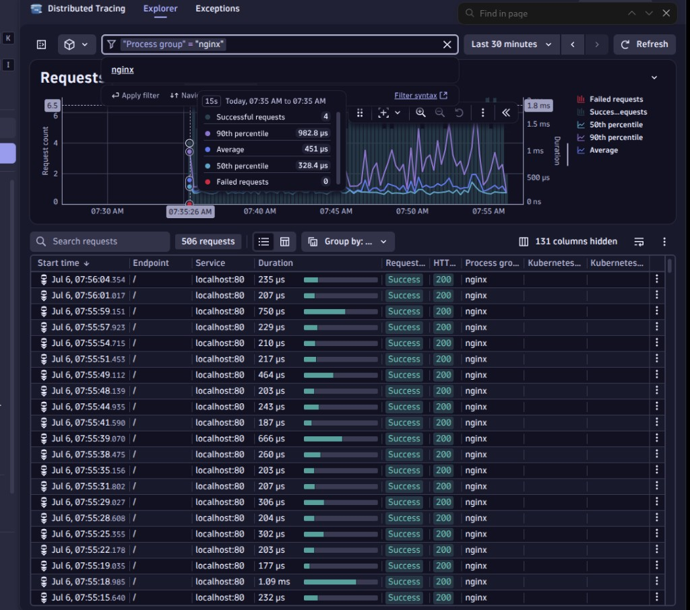
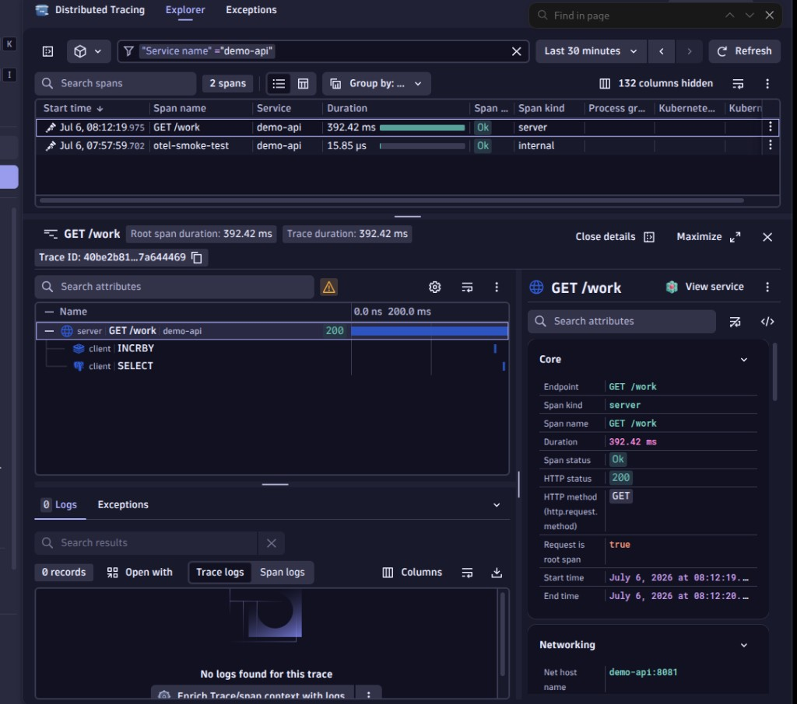
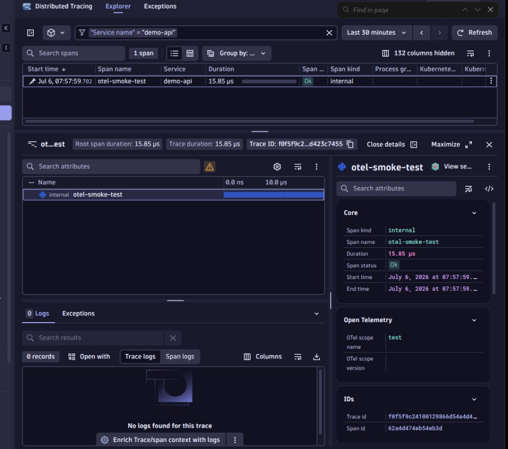

# M04-01 — Servicios y trazas (OneAgent + OpenTelemetry)

[← Página anterior](README.md) · [Siguiente página →](M04-02-problems-davis.md)

> Práctica del módulo. Requiere M03-01 (OneAgent conectado) y `DYNATRACE_INGEST_TOKEN` en `infra/.env`.

### Objetivo

Comparar lo que ve **OneAgent** (infra/nginx) con lo que ve **OpenTelemetry** en `demo-api`, y seguir una traza `GET /work` hasta Redis y PostgreSQL.

### Modelo del lab (Codespace)

```text
OneAgent contenedor  →  host, contenedores, nginx (Process group)
demo-api + OTel      →  OTLP → tenant → Spans: GET /work, INCRBY, SELECT
```

> En Codespace **no** hay OneAgent nativo en el host. La app envía trazas con **ingest token** (`openTelemetryTrace.ingest`).

### Prerrequisitos

- M03-01 completado.
- En `infra/.env`:
  - `DYNATRACE_ENVIRONMENT_URL=https://<id>.live.dynatrace.com`
  - `DYNATRACE_INGEST_TOKEN` con scope **`openTelemetryTrace.ingest`** (sin caracteres extra al copiar).
- `./scripts/lab-up.sh` (reconstruye `demo-api` con OTel).

---

### Paso 1 — Recordar qué ve OneAgent solo

**Acción:** <kbd>Ctrl</kbd>+<kbd>K</kbd> → **Distributed Tracing** → **Explorer**.

**Filtro (clave = valor):**

1. Clic **Type to filter** → **Process group** → `nginx`
2. Timeframe: **Last 30 minutes**

**Qué observar**

| Columna | Valor típico | Interpretación |
|---------|--------------|----------------|
| Service | `localhost:80` | Tráfico del **loadgen → demo-web** (no el API) |
| Endpoint | `/` | Página estática nginx |
| Process group | `nginx` | OneAgent, capa infra/HTTP superficial |

**Resultado esperado:** muchas filas; waterfall con **1 span** (solo nginx).

> Si el filtro tarda unos segundos en cargar, es normal.



---

### Paso 2 — Generar tráfico al API

**Acción:**

```bash
./scripts/generate-load.sh http://127.0.0.1:8081 90
```

**Qué observar en terminal:** peticiones sin error de conexión.

**Resultado esperado:** script termina con «Listo».

---

### Paso 3 — Abrir trazas OTel (vista Spans)

**Acción:** Misma app **Distributed Tracing** → **Explorer**.

1. Quita filtros anteriores
2. **Type to filter** → **Service name** → `demo-api`
3. Si la tabla de Requests está vacía → clic **Change to spans** (abajo)

**Qué observar**

| Columna | Valor esperado |
|---------|----------------|
| Span name | `GET /work` (también `/health`, `/slow`…) |
| Service | `demo-api` |
| Span kind | `server` |
| Span status | `Ok` |

**Resultado esperado:** al menos una fila `GET /work` distinta de `otel-smoke-test` (si hiciste la prueba manual).

> **Services** (app aparte) puede seguir en onboarding; en este lab el foco es **Distributed Tracing → Spans**.



---

### Paso 4 — Analizar el waterfall de `/work`

**Acción:** Clic en una fila **GET /work**.

**Qué observar en el waterfall**

```text
server  GET /work     ← Flask (span raíz, HTTP 200)
 ├─ client INCRBY     ← Redis
 └─ client SELECT     ← PostgreSQL
```

| Panel | Qué mirar | Qué interpretar |
|-------|-----------|-----------------|
| Waterfall | Barras anidadas | **Cadena de dependencias** de la petición |
| Duración total | ~50–400 ms en `/work` | Latencia de app + I/O |
| Span details (derecha) | HTTP status **200**, host `demo-api:8081` | Petición correcta |
| Logs (abajo) | Puede estar vacío | Logs OTel no configurados en M04; normal |

**Preguntas de interpretación**

1. ¿Cuántos spans hay? → Mínimo 3 (HTTP + Redis + DB).
2. ¿Dónde está el tiempo? → Mayormente en el span raíz (sleep + I/O).
3. ¿OneAgent mostraría esto sin OTel? → **No** en Codespace (deep monitoring limitado).

**Resultado esperado:** waterfall con hijos **INCRBY** y **SELECT**.



---

### Paso 5 — Comparar `/work` y `/slow`

**Acción:**

```bash
curl -s http://127.0.0.1:8081/work
curl -s http://127.0.0.1:8081/slow
```

En Spans, filtra **Span name** = `GET /slow` (o busca en la tabla con **Service** = `demo-api`).

**Qué observar:** duración de `/slow` ≈ **3 s** vs `/work` < 1 s.

**Resultado esperado:** diferencia clara de latencia en la columna Duration.

---

### Paso 6 — Errores HTTP (`/fail`)

**Acción:**

```bash
for i in $(seq 1 20); do curl -s http://127.0.0.1:8081/fail >/dev/null; done
```

**Filtro:** **HTTP status** = `500` o **Span name** contiene `fail`.

**Qué observar:** spans con status distinto de Ok (según versión UI).

**Resultado esperado:** trazas de error listas para **M04-02 Problems**.

---

## Comprueba tu entendimiento

| Pregunta | Respuesta |
|----------|-----------|
| ¿Por qué nginx aparece con OneAgent pero Flask no (antes de OTel)? | Deep monitoring limitado en contenedor |
| ¿Qué token usa OTel? | `DYNATRACE_INGEST_TOKEN` (no PaaS) |
| ¿Dónde ves `GET /work`? | Distributed Tracing → **Spans** → Service `demo-api` |
| ¿Qué son INCRBY y SELECT? | Spans hijos Redis y Postgres |

## Errores frecuentes

| Síntoma | Cómo arreglarlo |
|---------|-----------------|
| Sin spans `demo-api` | Token ingest inválido (401) → regenera con `openTelemetryTrace.ingest`; [TROUBLESHOOTING](../TROUBLESHOOTING.md) |
| Filtro `/work` en rojo | Usa **Span name** o **Service name**, no texto suelto |
| Solo `otel-smoke-test` | Rebuild: `docker compose -f infra/docker-compose.yml up -d --build demo-api` |
| Solo nginx en tracing | Estás en Process group nginx; cambia a Service `demo-api` + Spans |

## Referencia

- `infra/demo-web/api.py` — instrumentación OTel
- `scripts/generate-load.sh`
- [Dynatrace OTLP ingest](https://docs.dynatrace.com/docs/ingest-from/opentelemetry)
